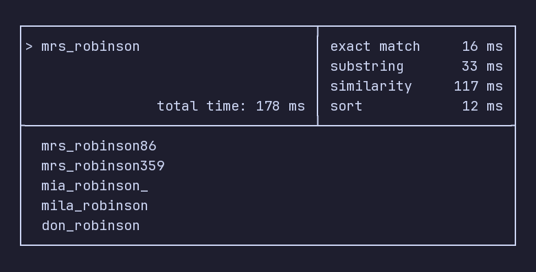

# Fast Fuzzy Search on Millions of Nicknames in PostgreSQL

There are plenty of articles about fuzzy search in PostgreSQL.
However, when I tried these approaches on a table with a few million rows,
some search terms turned out to be hundreds of times slower than others.
So let's build fuzzy search that stays fast regardless of inputs.



## Problem

Let's say we have a table `people` with ~3 million rows.
Each row has a `nickname` field consisting of lowercase `a-z`, `0-9`, and `_`.
We want to fuzzy search these nicknames.

Soundex and full-text search are usually a poor fit here —
nicknames are not natural language words.

## The Textbook Approach

The most natural and precise approach is described
in PostgreSQL's `pg_trgm` extension
[documentation](https://www.postgresql.org/docs/current/pgtrgm.html).
The extension provides trigram-based similarity.
So why don't we just sort by similarity and print out the best matches?

```sql
create extension if not exists pg_trgm;

create index on people using gist (nickname gist_trgm_ops);

select nickname, nickname <-> 'lemberg_caviar' as dist
from people
order by dist
limit 10;
```

In my testing on a DigitalOcean managed database (1 vCPU, 1 GB RAM)
it worked well until it became unusable at around 1 million rows.
Meanwhile latency sometimes went up to 800 ms (90th percentile),
outliers could reach 5 seconds.

This uses a GiST index to find the closest matches by trigram distance.
GIN, the other option provided by this extension,
cannot accelerate the `<->` (trigram distance) operator.

GiST is a tree index.
Each leaf stores a lossy signature (a fixed-size bitfield) of a row's trigrams.
Each trigram hashes to a bit position in the signature,
but different trigrams can collide —
hypothetically, `"aaa"`, `"bbb"`, and `"ccc"` might all set bit 5.

Internal tree nodes store the bitwise OR of all their children's signatures.
This lets the index explore only subtrees where the trigram bit is present.

GiST signature length can be tuned with `siglen`,
which can reduce false positives at the cost of a larger index,
but in our tests it did not close the gap enough on multi-million-row tables.

## The Next Option: GIN

The other index type `pg_trgm` offers is GIN.
GIN maps each trigram to the rows that contain it.
For example, to find the `"lemberg_caviar"` substring
(`LIKE '%lemberg\_caviar%'` predicate),
GIN looks up the rows for each trigram
(`"  l"`, `" le"`, `"lem"`, `"emb"`, `"mbe"`, `"ber"`, `"erg"`, `"rg "`,
`"  c"`, `" ca"`, `"cav"`, `"avi"`, `"via"`, `"iar"`, `"ar "`)
and returns only rows where all of them are present.
This scales much better than GiST on large tables.
But it has its own blind spots.

## When GIN Trigrams Break Down

**Short search terms** match a huge fraction of the table.
For example, `"ab"` produces space-padded trigrams like `"  a"` and `" ab"`,
which are much more common than 3 letter trigrams.
A GIN trigram index on 3.3 million rows
returns 1.7 million candidate rows for `"ab"` —
worse yet, GIN must build the entire bitmap before returning any row,
which takes up to 8 seconds in my tests.

**Repeated characters** cause too many false positives.
For example, let's work through a condition `LIKE '%aaaaaa%'`.
The search term `"aaaaaa"` produces a single useful trigram `"aaa"` —
`pg_trgm` does not count how many times a trigram occurs,
it only checks its presence.
So GIN only narrows results to rows containing `"aaa"` —
most of which don't actually contain `"aaaaaa"`.
This makes the search painfully slow.

**Non-alphanumeric characters** are invisible to `pg_trgm`.
`show_trgm('_____')` returns an empty array.
A username made of underscores
cannot be narrowed by any PostgreSQL trigram index.

No single index or operator covers all of these cases.
The key insight is: don't try to find one.

## Solution: Multi-Leg Search

GIN works well for most queries
but each edge case above needs its own index and query.
Instead of handling all inputs with one query,
let's split the search into multiple legs
and pick the ones that are fast for the specific search term at hand.
We decide which legs to run on the application side,
then deduplicate their results and sort by trigram distance.
We use a temp table rather than `UNION ALL` CTEs
because each leg needs its own `SET LOCAL` planner overrides.

```sql
begin;

-- leg 1: exact match
create temp table _search_results on commit drop as
select nickname from people
where nickname = 'lemberg_caviar'; -- search term

-- leg 2: similarity
set local enable_seqscan = off;
set local enable_indexscan = off;
set local enable_indexonlyscan = off;
set local enable_bitmapscan = on;
set local pg_trgm.word_similarity_threshold = 0.5;
insert into _search_results
select nickname from people
where nickname %> 'lemberg_caviar' -- search term
limit 100;

-- other legs: substring, repeated characters,
-- non-alphanumeric runs, prefix — details below

-- deduplicate + sort
select nickname from (
    select distinct nickname from _search_results
) sub
order by nickname <-> 'lemberg_caviar' -- search term
limit 10;

commit;
```

In this example all legs run unconditionally.
In practice, we analyse the search term first
and only enable the legs that are fast
for the given search term — more on this below.

Ideally each leg would return the closest matches by trigram distance,
but such ordering is too expensive on large tables.
So each "fuzzy" leg collects `LIMIT 100` in arbitrary order —
which turns out to be good enough in practice —
and the final sort ranks only those candidates.

The temporary table with `ON COMMIT DROP`
cleans itself up when the transaction ends.

## The Legs

### 1. Exact Match Leg

```sql
create temp table _search_results on commit drop as
select nickname from people
where nickname = 'lemberg_caviar'; -- search term
```

Uses a B-tree index to check
if the search term matches an existing record exactly.
This is cheap and ensures an exact match is included if one exists.

**Activate when:** always.

**Prerequisites:** a B-tree index with `text_pattern_ops`, which also supports `=`.
Actually you can use a plain B-tree index (without `text_pattern_ops`);
more on this in leg 6.

```sql
create index on people (nickname text_pattern_ops);
```

### 2. Main Substring Leg (accelerated by GIN trigram index)

```sql
-- force GIN bitmap scan (planner sometimes prefers a slower btree scan)
set local enable_seqscan = off;
set local enable_indexscan = off;
set local enable_indexonlyscan = off;
set local enable_bitmapscan = on;

insert into _search_results
select nickname from people
where nickname like '%lemberg\_caviar%' -- LIKE-escaped search term
limit 100;
```

`'lemberg\_caviar'` is the search term with `LIKE` metacharacters escaped:
`_` ⟶ `\_`, `%` ⟶ `\%`, `\` ⟶ `\\`.

This is the workhorse leg.
`pg_trgm` uses the search term's trigrams to produce candidate rows,
which are then rechecked against the `LIKE` predicate.

**Activate when:**

- the longest alphanumeric run in the search term is at least 3
  (shorter runs can produce trigrams that match too many rows,
  so PostgreSQL must build a huge bitmap before returning data)
- the longest repeated-character run in the search term is below 5
  (above that, the single useful trigram matches too broadly)

**Prerequisites:** a GIN trigram index.

```sql
create index on people using gin (nickname gin_trgm_ops);
```

### 3. Main Fuzzy Leg (word similarity)

```sql
-- force GIN bitmap scan (planner sometimes prefers a slower btree scan)
set local enable_seqscan = off;
set local enable_indexscan = off;
set local enable_indexonlyscan = off;
set local enable_bitmapscan = on;
set local pg_trgm.word_similarity_threshold = 0.5;

insert into _search_results
select nickname from people
where nickname %> 'lemberg_caviar' -- search term
limit 100;
```

This is where all the fuzziness comes from.
The `%>` operator (word similarity) slides the search term
across every position in the target string and takes the best similarity score.
It catches typos, transpositions, and partial matches that `LIKE` would miss.
Despite the name, word similarity in `pg_trgm` is still trigram-based;
it does not depend on dictionaries or linguistic tokenization.
For nicknames, its usefulness comes from allowing
a good substring-level match inside a longer value.

We raise the threshold from the default 0.3 to 0.5
to avoid flooding the result set with poor matches.

**Activate when:**

- the search term has at least 2 alphanumeric characters
- the search term is at least 4 characters long

**Prerequisites:** the same GIN trigram index as leg 2.

**Why `%>` and not `%`:**
the `%` operator computes similarity over the entire strings.
A short search term like `"kate"` has low whole-string similarity
against a longer value like `"katesmithxyz"`,
so most GIN candidates fail the recheck.
In practice, `%` has to scan thousands of heap blocks
(GIN does not support `INCLUDE` as of PostgreSQL 18)
to find 100 matches, while `%>` finds them almost immediately
because substring-level matching is much more generous.

### 4. Repeated-Run Rescue Leg (accelerated by longest repeated character index and GIN)

```sql
-- force bitmap scan for BitmapAnd
-- between max_repeated_alnum_run btree index and GIN
set local enable_seqscan = off;
set local enable_indexscan = off;
set local enable_indexonlyscan = off;
set local enable_bitmapscan = on;

insert into _search_results
select nickname from people
where max_repeated_alnum_run(nickname)
    -- precompute during analysis in prod
    >= max_repeated_alnum_run('lemberg_caviar')
  and nickname like '%lemberg\_caviar%' -- LIKE-escaped search term
limit 100;
```

Some queries defeat `pg_trgm` entirely —
`"aaaaaa"` produces a single useful trigram `"aaa"`,
which matches far too many rows.
A functional index on the longest repeated run
helps narrow the search (via BitmapAnd).

**Activate when:** the longest repeated-character run
in the search term is at least 5.

**Prerequisites:** a custom SQL function and a partial index.

```sql
create function max_repeated_alnum_run(text)
returns int as $fn$
    select coalesce(max(length(m[1])), 0)
    from regexp_matches($1, '(([a-z0-9])\2*)', 'g') as m
$fn$ language sql immutable;

create index on people (
    max_repeated_alnum_run(nickname)
) where max_repeated_alnum_run(nickname) >= 5;
```

The regex assumes lowercase ASCII nicknames (`[a-z0-9]`),
matching the alphabet defined in the Problem section.
The partial index is quite small.

### 5. Non-Alnum Rescue Leg (accelerated by longest non-alnum run index)

```sql
-- force index-only scan on the max_nonalnum_run index;
-- GIN produces no trigrams for nonalnum characters
-- and can worsen timings by orders of magnitude
set local enable_seqscan = off;
set local enable_indexscan = off;
set local enable_indexonlyscan = on;
set local enable_bitmapscan = off;

insert into _search_results
select nickname from people
where max_nonalnum_run(nickname)
    -- precompute during analysis in prod
    >= max_nonalnum_run('lemberg_caviar')
  and nickname like '%lemberg\_caviar%' -- LIKE-escaped search term
limit 100;
```

The same technique with a function
that measures the longest non-alphanumeric run.
Since `pg_trgm` produces zero trigrams
for these characters (`show_trgm('_____')` returns `{}`),
this leg is an effective way to find such patterns.

**Activate when:** the longest non-alphanumeric run
in the search term is at least 3.

**Prerequisites:** same technique as leg 4.

```sql
create function max_nonalnum_run(text)
returns int as $fn$
    select coalesce(max(length(m[1])), 0)
    from regexp_matches($1, '([^a-z0-9]+)', 'g') as m
$fn$ language sql immutable;

create index on people (
    max_nonalnum_run(nickname)
) include (nickname)
where max_nonalnum_run(nickname) >= 3;
```

The partial index is quite small and `INCLUDE` enables index-only scans.

### 6. Prefix Fallback Leg

```sql
-- force index-only scan on text_pattern_ops btree
set local enable_seqscan = off;
set local enable_indexscan = off;
set local enable_indexonlyscan = on;
set local enable_bitmapscan = off;

insert into _search_results
select nickname from people
where nickname like 'lemberg\_caviar%' -- LIKE-escaped search term
limit 100;
```

This is a useful fallback for very short or low-information inputs.
Prefix matching is fast but only finds nicknames starting with the search term.
It still provides useful results for short queries
where substring or similarity would match almost arbitrary strings.

**Activate when:** no other content-based leg qualifies:

- longest alphanumeric run in the search term below 3
- longest non-alphanumeric run in the search term below 3

**Prerequisites:** the same `text_pattern_ops` B-tree index as leg 1.
Actually you can use a plain B-tree index (without `text_pattern_ops`),
if you use `collate "C"`, which is justified in our case —
nicknames are always Latin.

Note that `collate "C"` uses raw byte ordering, so comparisons become
case-sensitive and locale-unaware — `'Z' < 'a'` and accented characters
sort by their byte values rather than linguistic rules.
A regular B-tree index can only accelerate `LIKE` prefix queries
under the C collation.
Most databases use a locale-aware collation like `en_US.UTF-8`,
so you would need to specify `collate "C"` yourself.
`text_pattern_ops` uses byte-wise comparison,
so prefix `LIKE` works regardless of collation.

## Which Legs to Run

To make decisions on which legs to run
according to **Activate when** conditions you see above,
let's analyse the search term on the application side:

| Metric            | What it measures                                 |
| ----------------- | ------------------------------------------------ |
| Alnum count       | Total alphanumeric characters                    |
| Max alnum run     | Longest consecutive `[a-z0-9]` substring         |
| Max repeated run  | Longest run of the _same_ alphanumeric character |
| Max non-alnum run | Longest consecutive non-alphanumeric substring   |

These four numbers determine which legs will produce useful results
in a reasonable time and which would thrash and slow down the index.
For example, a search term like `"aaaaaa"` has a max repeated run of 6 —
it should skip the GIN substring leg and use a specialised index instead.
A search term like `"___"` has a max non-alphanumeric run of 3
and zero alphanumeric characters — trigram indexes are useless here.

Here is a summary of the activation rules:

| Leg                 | Purpose                     | Run when                                   |
| ------------------- | --------------------------- | ------------------------------------------ |
| Exact match         | Include exact hit           | Always                                     |
| Main substring      | Main substring filter       | Max alnum run ≥ 3 and max repeated run < 5 |
| Main fuzzy          | Fuzzy/typo matching         | Alnum count ≥ 2 and length ≥ 4             |
| Repeated-run rescue | Handle inputs like `aaaaaa` | Max repeated run ≥ 5                       |
| Non-alnum rescue    | Handle inputs like `___`    | Max non-alnum run ≥ 3                      |
| Prefix fallback     | Low-information fallback    | No stronger content-based leg qualifies    |

## Planner Control

PostgreSQL's query planner picks indexes automatically,
but the wrong choice can be two orders of magnitude slower.
Since we validated each leg with `EXPLAIN ANALYZE` and benchmarking,
we know exactly which index to use and force it
with `SET LOCAL` before each leg:

```sql
set local enable_seqscan = off;
set local enable_indexscan = off;
set local enable_indexonlyscan = off;
set local enable_bitmapscan = on;
-- now the planner must use bitmap scan (GIN)
```

`SET LOCAL` scopes changes to the current transaction, so nothing leaks.
It is usually not recommended to override planner settings.
However, in our testing PostgreSQL chose the wrong path quite often,
so we don't really have a choice here.

### Prepared Statements

If your database driver uses prepared statements, beware of generic plans.
PostgreSQL uses custom plans for the first few executions,
taking current `SET LOCAL` settings into account.
After several executions it may switch to a generic plan
that was optimised without the planner overrides —
undoing the `SET LOCAL` settings entirely.

We have to use unprepared (simple-protocol) execution
for leg queries to ensure the planner respects the overrides every time.

## Final Sorting

After all legs have contributed their candidates, deduplicate and sort:

```sql
select nickname from (
    select distinct nickname from _search_results
) sub
order by nickname <-> 'lemberg_caviar' -- search term
limit 10;
```

The `<->` operator computes trigram distance — lower values mean closer matches.
No index is needed here because the candidate set is small
(at most a few hundred rows in the temp table, most likely cached in memory).

The `DISTINCT` eliminates duplicates from legs that found the same row.
The outer `LIMIT` returns only the top matches.

## Performance Techniques

Use pipeline mode if your driver supports it (libpq, pgx) —
all legs go in one batch, reducing round trips to a single flight.

Keep everything in one transaction so `SET LOCAL` settings don't leak,
the temp table lives for all legs, and you get a consistent snapshot.

## Results

We benchmarked 178 search terms on a 3.3-million-row table
on a DigitalOcean managed database (1 vCPU, 1 GB RAM).
Here are 20 randomly selected results:

| Search term                         | ms  |
| ----------------------------------- | --- |
| `______________________________`    | 3   |
| `__a__b__`                          | 40  |
| `a________________________________` | 2   |
| `b___`                              | 5   |
| `ee`                                | 5   |
| `emma`                              | 30  |
| `ethan`                             | 21  |
| `finn`                              | 12  |
| `lily_grace_park_nash`              | 89  |
| `mason`                             | 29  |
| `max`                               | 5   |
| `mia_lynn_jones_hall`               | 88  |
| `noah_james_kim`                    | 72  |
| `nora`                              | 16  |
| `owen`                              | 8   |
| `owen_rose_park_cruz`               | 47  |
| `qjonpbvhpysdhr`                    | 3   |
| `ryan_lynn_bell`                    | 38  |
| `xyz`                               | 3   |
| `zoe`                               | 4   |

Over all 178 search terms:
median = 31 ms, 90th percentile = 51 ms, maximum = 131 ms.

The raw `nickname` data is about 39 MB. Index sizes relative to the data:

| Index                               | Size   | % of nickname data |
| ----------------------------------- | ------ | ------------------ |
| GIN trigram                         | 122 MB | 313%               |
| B-tree `text_pattern_ops`           | 100 MB | 256%               |
| max_nonalnum_run (partial, INCLUDE) | 248 kB | < 1%               |
| max_repeated_alnum_run (partial)    | 112 kB | < 1%               |

The exact numbers depend on your data distribution, hardware, and query patterns,
but the technique consistently keeps searches fast
across the full range of input shapes.

The key takeaway: don't search for one perfect index strategy.
Classify your inputs, run the right leg for each class,
and let the union plus trigram sorting produce a cohesive result.

This design deliberately optimises for low and stable latency,
not exhaustive recall.
Each leg contributes a bounded number of candidates,
and the final ranking happens only within that union.

## Write-Side Cost of GIN

The GIN trigram index is the largest index in the table in our case
and also the most expensive to maintain during writes.

The problem is, normally for every row you need to update just one index record.
But GIN maps each trigram to every row containing it,
so for each new nickname GIN must add a record for every trigram in the nickname.

We benchmarked 200-row operations on a 3.3-million-row table
(same DigitalOcean setup as the read benchmarks).
Each result averaged over 10 iterations:

| Operation                          | Without GIN | With GIN | Slower by |
| ---------------------------------- | ----------- | -------- | --------- |
| Pure `INSERT`                      | 227 ms      | 425 ms   | ~87%      |
| Pure `UPDATE`                      | 333 ms      | 569 ms   | ~71%      |
| `INSERT ... ON CONFLICT DO UPDATE` | 443 ms      | 898 ms   | ~103%     |

Even `UPDATE` statements that do not modify `nickname`
can still pay the GIN cost.
PostgreSQL writes a new heap tuple version for every update.
If the update cannot be done as a HOT (Heap-Only Tuple) update —
because there is not enough free space on the same page,
or because an indexed column changed —
PostgreSQL must create new index entries
for the new tuple version, including in the GIN index.

The upsert path (`INSERT ... ON CONFLICT DO UPDATE`) is the most expensive
because it attempts an insert first, tentatively touching GIN,
before falling back to an update on conflict.

For a read-heavy workload like search, this is an acceptable trade-off —
the GIN index makes reads orders of magnitude faster.
But for tables with frequent writes, the overhead is worth monitoring.
We did not tune GIN maintenance parameters here;
the write benchmarks reflect default managed-Postgres settings.

## Testing Tool

The [companion repository](https://github.com/bcmk/siren-fuzzy-search)
includes an interactive terminal tool
for testing search against a live database.
It connects to PostgreSQL directly, runs all the legs described above,
and shows results with per-leg timings as you type.

The tool helped catch slow edge cases early — you can try any input pattern
and immediately see which legs fire and how long each one takes.

## Where We Use This

This technique powers the streamer search
in [SIREN](https://github.com/bcmk/siren),
a Telegram bot for webcast alerts.
